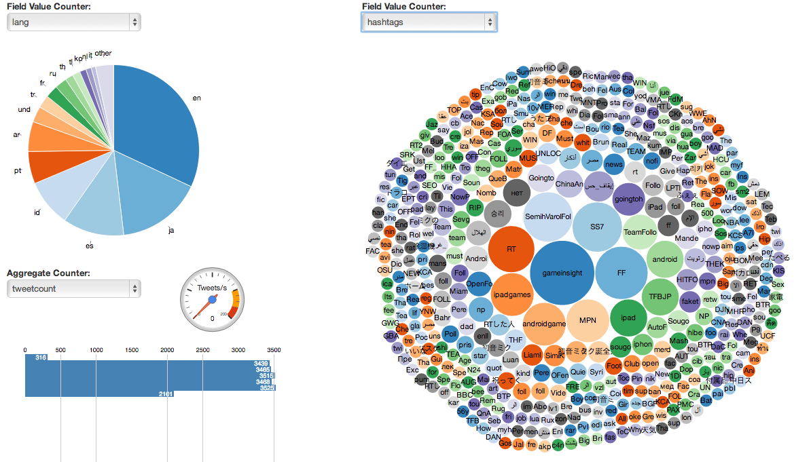

analytics-dashboard
===================

Standalone project which shows how you can use the D3 Javascript library to create visualizations for Spring XD counters.

Running the App
===============

To provide some data for appliation, start the XD server and then execute the following commands in the XD shell. 

NOTE: We're using `twitterstream` as a source which assumes the twitterstream module configuration  `$XD_MODULE_CONFIG_LOCATION/source/twitterstream/twitterstream.properties` is correctly populated with valid keys.

    xd:> stream create tweets --definition "twitterstream | log"

    xd:> stream create tweetlang  --definition "tap:stream:tweets > field-value-counter --fieldName=lang" --deploy

    xd:> stream create tweetcount --definition "tap:stream:tweets > aggregate-counter" --deploy

    xd:> stream create tagcount --definition "tap:stream:tweets > field-value-counter --fieldName=entities.hashtags.text --name=hashtags" --deploy

    xd:> stream deploy tweets

These taps correspond to recording

* A count of tweet's language.  The incoming JSON data from the twitter stream has this information located under the field named `lang`.  This is done using the [Field Value Counter](https://github.com/spring-projects/spring-xd/wiki/Analytics#field-value-counter) sink.  The name of the counter default to the name of the stream, 'tweetlang'
* The number of tweets pre-aggregated into minute, hour, day, month and year time buckets.  This information is used to show the graph of tweets per minute in the UI and is based on the [Aggregate Counter](https://github.com/spring-projects/spring-xd/wiki/Analytics#aggregate-counter) sink.
* A count of the hashtags in the tweets.  The incoming JSON data from the twitter stream has this information ocated under the path `entities.hashtags.text`.  The name of the counter is explicitly specified to be 'hashtags'.

All that's required to run the app is to serve up the `public` directory from a web server listening on port 9889. There are various ways you can do this. For example, you can use the Spring Boot CLI. If you have it [installed](http://docs.spring.io/spring-boot/docs/1.1.4.RELEASE/reference/html/getting-started-installing-spring-boot.html#getting-started-installing-the-cli), run

    spring run dashboard.groovy

Or if you have ruby installed, run

    ruby -run -e httpd ./public -p 9889

from the `analytics-dashboard` directory. 

Alternatively, if you have nginx installed, 
    
    start-nginx.sh

Then point your browser at [http://localhost:9889/dashboard.html](http://localhost:9889/dashboard.html).

The page is a simple dashboard divided in half. The right hand side will show a field value counter as a bubble chart. The left is divided into two panels, one which will show a field value counter as a pie chart, and one below it for an aggregate counter bar chart. The menus are populated by querying the Spring XD admin server, which is expected to also be running on localhost. You can toggle between the different field-value counters, the one for hashtags is best displayed using a bubble chart.

## Resources
* Article: http://blog.pivotal.io/pivotal/products/spring-xd-for-real-time-analytics
* Video: https://www.youtube.com/watch?v=nOfzrQ6CdKI
* Setup twitter application (authentication) 
  * https://twittercommunity.com/t/how-do-i-find-my-consumer-key-and-secret/646
  * https://apps.twitter.com/
  * https://support.twitter.com/articles/110250-adding-your-mobile-number-to-your-account-via-web
* Github: https://github.com/spring-projects/spring-xd-samples
* Others
  * http://www.infoq.com/articles/introducing-spring-xd
  * http://projects.spring.io/spring-xd/#quick-start
  * spring-xd wiki: https://github.com/spring-projects/spring-xd/wiki
  * http://www.javacodegeeks.com/2015/03/spring-xd-for-data-ingestion.html
  * http://spring.io/blog/2014/12/09/springone2gx-2014-replay-develop-powerful-big-data-applications-easily-with-spring-xd
  * Spring XD Internals: A Guided Tour https://www.youtube.com/watch?v=lteee9N816k
  * http://docs.spring.io/spring-xd/docs/current/reference/html/
  * http://hortonworks.com/hadoop-tutorial/using-spring-xd-to-stream-tweets-to-hadoop-for-sentiment-analysis/
